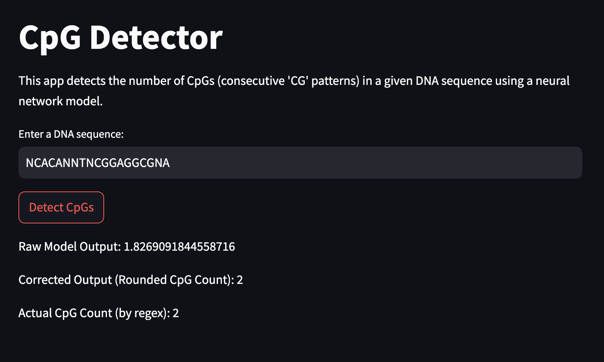

## Autonimize AI assessment : CpG Detector

This repository contain my approach, solution and releventd details as asked.

## Synopsis
CpG Detector is a web application built to predict the number of CpG (consecutive "CG" patterns) in a given DNA sequence. The project leverages a neural network model using a bidirectional LSTM architecture to handle variable-length DNA sequences and outputs the predicted CpG count.

This project can be accessed via a web interface built using Streamlit, where users can input DNA sequences and get results from both the neural network and regex-based methods.

## Results
The CpG Detector successfully predicts CpG counts with a reasonable accuracy, achieving low Mean Absolute Error (MAE) and Mean Squared Error (MSE) during the validation process. Below are the key metrics obtained from the evaluation:

1. Without Padding (Task 1)

| Metric                     | Value  |
|-----------------------------|---------|
| **Mean Absolute Error (MAE)**| 0.1613 |
| **Mean Squared Error (MSE)** | 0.0471 |
| **R-squared Score**          | 0.9887 |


2. With Padding (Task 2)

| Metric                     | Value  |
|-----------------------------|---------|
| **Mean Absolute Error (MAE)**| 0.2465 |
| **Mean Squared Error (MSE)** | 0.1015 |
| **R-squared Score**          | 0.9741 |


## Instructions to run the web-app



### Prerequisites
- Python 3.7+
- A working environment with the necessary packages listed in `requirements.txt`.

### Installation

1. Clone the repository:
   ```bash
   git clone https://github.com/edsml-sb3323/Autonomize-AI-assessment

2. Install requirements.txt:
   ```bash
   pip install -r requirements.txt

3. Run the web-app:
   ```bash
   streamlit run main.py 
